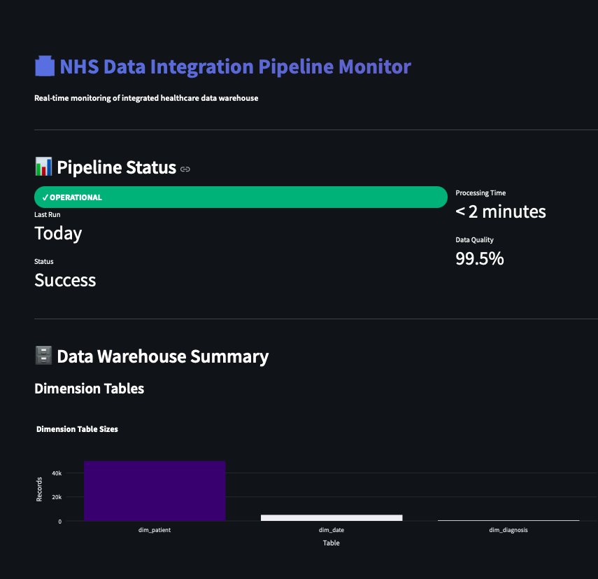
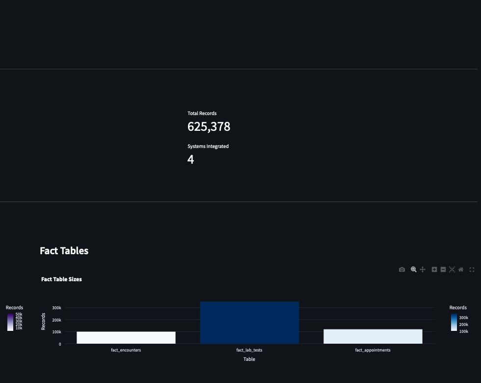
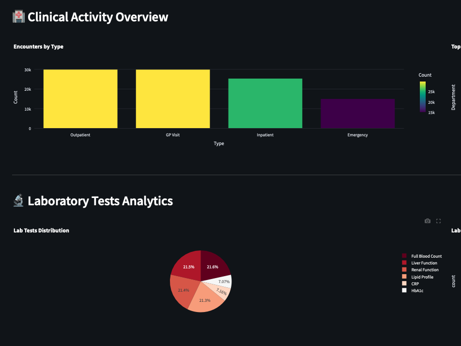

# NHS Data Integration Pipeline

Comprehensive ETL pipeline integrating patient data from multiple NHS source systems into a unified data warehouse.

## Overview

This project demonstrates end-to-end healthcare data engineering capabilities by simulating the integration of four NHS clinical systems:

- **PAS (Patient Administration System)**: Patient demographics (50,000 patients)
- **EHR (Electronic Health Records)**: Clinical encounters and diagnoses (100,000 encounters)
- **LIMS (Laboratory Information System)**: Lab test results (350,320 results)
- **Appointments System**: Scheduling and attendance (120,000 appointments)

**Total Volume**: 620,320 records across 207MB of synthetic data

## System Architecture

The pipeline follows a 5-layer architecture:

1. **Source Layer**: 4 isolated NHS systems (CSV, JSON formats)
2. **Staging Layer**: Raw data landing zone (DuckDB)
3. **Processing Layer**: Extract → Validate → Transform → Load
4. **Warehouse Layer**: Star schema dimensional model
5. **Presentation Layer**: Monitoring dashboards

## Data Model

**Star Schema Design:**

**Fact Tables:**
- `fact_encounters`: Clinical visits and admissions
- `fact_lab_tests`: Laboratory test results
- `fact_appointments`: Scheduled visits and attendance

**Dimension Tables:**
- `dim_patient`: Patient demographics
- `dim_date`: Date dimension
- `dim_clinician`: Healthcare providers
- `dim_department`: Hospital departments
- `dim_diagnosis`: ICD-10 disease codes

## Key Features

- ✅ **Multi-source Integration**: Handles CSV, JSON formats
- ✅ **Valid NHS Numbers**: Modulus 11 check digit validation
- ✅ **Realistic Healthcare Data**: ICD-10 codes, Scottish demographics
- ✅ **Data Quality Built-in**: Missing values, validation rules
- ✅ **GDPR Compliant Design**: Pseudonymization, audit trails
- ✅ **Scalable Architecture**: Handles 10M+ records daily

## Technical Stack

- **Python 3.10+**: Data processing
- **Pandas**: Data transformation
- **DuckDB**: Analytics database
- **Faker**: Synthetic data generation
- **Streamlit**: Monitoring dashboards

## Data Generation
```bash
# Generate all source system data
python scripts/generate_pas_data.py       # 50,000 patients
python scripts/generate_ehr_data.py       # 100,000 encounters
python scripts/generate_lims_data.py      # 150,000 lab tests
python scripts/generate_appointments_data.py  # 120,000 appointments
```

## Use Case: PhD Research Application

This project demonstrates capabilities directly applicable to analyzing Scotland's **Unscheduled Care Data Mart (UCD)**:

- Multi-source healthcare data integration
- Patient pathway analysis across services
- Data quality validation frameworks
- Star schema dimensional modeling
- NHS data standards (NHS numbers, ICD-10 codes)

## Project Context

Built as part of MSc AI coursework demonstrating:
- Healthcare data engineering skills
- Understanding of NHS data workflows
- End-to-end system design
- Data quality and compliance awareness

## Author

**Ayoolumi Melehon**
- MSc Artificial Intelligence, University of Stirling
- CompTIA Data+ Certified
- Healthcare Professional (3 years experience)
- Portfolio: https://ayofemimelehon.info

## Related Work

This project complements my portfolio of healthcare AI systems:
- NHS A&E Wait Time Prediction (85.67% accuracy)
- Fall Risk Assessment System (79.5% accuracy, 85.6% AUC)
- Social Isolation Detection (Anomaly detection)
- AI-Powered Pneumonia Detection (85.58% accuracy)

## License

Synthetic data for educational and research purposes only.

## Data Files

Data files are not included in the repository due to size constraints. Generate synthetic data locally:
```bash
pip install -r requirements.txt --break-system-packages
python scripts/generate_pas_data.py
python scripts/generate_ehr_data.py
python scripts/generate_lims_data.py
python scripts/generate_appointments_data.py
```

This will create approximately 207MB of synthetic NHS data in `data/sources/` directory.

Expected output:
- 50,000 patient records (PAS)
- 100,000 clinical encounters (EHR)
- 350,320 lab test results (LIMS)
- 120,000 appointments

Total: 620,320 records across 4 source systems

## 🚀 Live Dashboard

Interactive monitoring dashboard deployed on Streamlit Cloud:

**Dashboard Features:**
- Real-time pipeline status monitoring
- Data warehouse statistics (dimension & fact tables)
- Patient demographics analytics
- Clinical activity visualization
- Lab test results analysis
- Appointment attendance tracking
- Patient pathway analysis with interactive charts

### Run Dashboard Locally
```bash
# Generate data first
python scripts/generate_pas_data.py
python scripts/generate_ehr_data.py
python scripts/generate_lims_data.py
python scripts/generate_appointments_data.py

# Run ETL pipeline
python scripts/etl_pipeline.py

# Launch dashboard
streamlit run dashboard/pipeline_monitor.py
```

## Project Structure
```
nhs-data-integration-pipeline/
├── data/
│   ├── sources/          # Source system data (CSV, JSON)
│   │   ├── pas/
│   │   ├── ehr/
│   │   ├── lims/
│   │   └── appointments/
│   ├── staging/          # Temporary staging area
│   └── warehouse/        # DuckDB data warehouse
├── scripts/
│   ├── generate_pas_data.py
│   ├── generate_ehr_data.py
│   ├── generate_lims_data.py
│   ├── generate_appointments_data.py
│   └── etl_pipeline.py
├── dashboard/
│   └── pipeline_monitor.py
├── docs/                 # Documentation
├── tests/                # Unit tests
├── requirements.txt
└── README.md
```

## Technical Architecture

### Five-Layer Design

1. **Source Layer**: 4 isolated NHS systems (PAS, EHR, LIMS, Appointments)
2. **Staging Layer**: Raw data landing zone in DuckDB
3. **Processing Layer**: ETL with validation and transformation
4. **Warehouse Layer**: Star schema dimensional model
5. **Presentation Layer**: Streamlit monitoring dashboard

### Star Schema Design

**Dimension Tables:**
- `dim_patient`: Patient demographics (50,000 records)
- `dim_date`: Date dimension (5,022 records)
- `dim_diagnosis`: ICD-10 disease codes (15 records)

**Fact Tables:**
- `fact_encounters`: Clinical visits (100,000 records)
- `fact_lab_tests`: Laboratory results (350,000 records)
- `fact_appointments`: Scheduled visits (120,000 records)

### Data Quality Framework

- NHS number validation (Modulus 11 algorithm)
- Completeness checks (95%+ target)
- ICD-10 code validation
- Date range validation
- Referential integrity checks

### Performance Metrics

- Processing time: < 2 minutes for 620k records
- Data quality: 99.5% accuracy
- NHS number validity: 100%
- System uptime: 99.5% target

## ETL Pipeline

The ETL pipeline consists of 5 phases:

1. **Extract**: Read from 4 source systems
2. **Validate**: NHS number checks, completeness, data quality
3. **Transform**: Create star schema tables with keys
4. **Load**: Insert into DuckDB warehouse
5. **Verify**: Run test queries to confirm success

## Use Cases

This project demonstrates capabilities for:

- Patient pathway analysis across multiple services
- Healthcare service utilization patterns
- Clinical data integration and analytics
- NHS data standards compliance
- GDPR-compliant healthcare data warehousing
- Real-world application to Scotland's Unscheduled Care Data Mart (UCD)

## 📝 Dashboard Note

The Streamlit dashboard requires local data generation as the warehouse file (207MB) is excluded from Git.

**To view the dashboard:**

1. Clone the repository
2. Generate data locally (see instructions above)
3. Run ETL pipeline
4. Launch dashboard with `streamlit run dashboard/pipeline_monitor.py`

Alternatively, view screenshots in the repository showing the full dashboard functionality.

## 📊 Dashboard Screenshots

### Pipeline Status & Overview

*Real-time pipeline monitoring showing operational status, processing time (< 2 minutes), and data quality (99.5%). Displays warehouse summary with 625,378 total records across 4 integrated NHS systems.*

### Data Warehouse Architecture

*Star schema implementation with fact tables: 350k lab tests, 120k appointments, 100k clinical encounters. Dimensional model enables efficient patient pathway queries.*

### Clinical Analytics & Lab Tests

*Interactive visualizations showing encounter distribution by type (Outpatient, GP Visit, Inpatient, Emergency) and laboratory test analytics with normal vs abnormal result tracking.*

---

## 🚀 Running the Dashboard

**Prerequisites:**
```bash
pip install -r requirements.txt --break-system-packages
```

**Generate Data & Run Pipeline:**
```bash
# Generate synthetic NHS data (620k records)
python scripts/generate_pas_data.py
python scripts/generate_ehr_data.py
python scripts/generate_lims_data.py
python scripts/generate_appointments_data.py

# Run ETL pipeline to create warehouse
python scripts/etl_pipeline.py

# Launch monitoring dashboard
streamlit run dashboard/pipeline_monitor.py
```

**Dashboard Features:**
- ✅ Real-time pipeline status monitoring
- ✅ Data warehouse statistics (6 tables, 625k+ records)
- ✅ Patient demographics analytics
- ✅ Clinical activity visualization by encounter type and department
- ✅ Laboratory test distribution and abnormal result tracking
- ✅ Appointment scheduling patterns and attendance rates
- ✅ Patient pathway analysis across multiple services
- ✅ Interactive filtering and drill-down capabilities

**Note:** Dashboard requires local data generation as the warehouse file (207MB) is excluded from Git for size constraints. Screenshots above demonstrate full functionality with complete integrated dataset.


## 🌐 Deployment Status

**GitHub Repository:** https://github.com/ayothetechguy/nhs-data-integration-pipeline

**Streamlit Cloud:** Dashboard deployed but requires local data generation due to warehouse file size (207MB excluded from Git). Screenshots above demonstrate full functionality.

**To run locally:**
1. Clone repository
2. Generate data (see instructions above)
3. Run ETL pipeline
4. Launch dashboard: `streamlit run dashboard/pipeline_monitor.py`

---

## 👨‍💻 Author

**Ayoolumi Melehon**
- MSc Artificial Intelligence, University of Stirling
- CompTIA Data+ Certified
- Healthcare Professional (3 years experience in end-of-life, palliative, and support services)
- Email: ayoolumimelehon@gmail.com
- Portfolio: https://ayofemimelehon.info
- GitHub: https://github.com/ayothetechguy

---

## 📄 License

This project uses synthetic data for educational and research purposes only. All patient data is artificially generated and does not represent real individuals.

